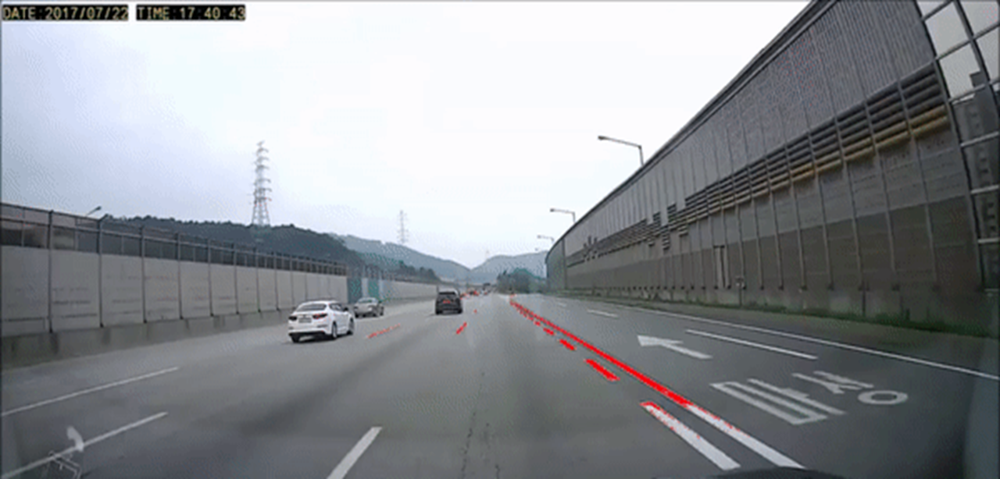
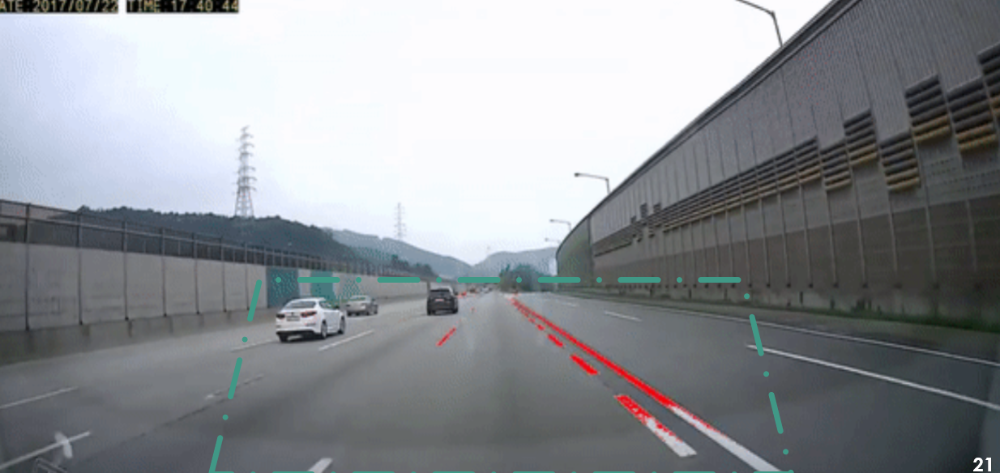

# opencv-car-detection

> frames -> fix -> object -> increase -> video


#### 비디오 프레임으로 쪼개기

```python
def video_to_frames(video, path_output_dir):
    vidcap = cv2.VideoCapture(video)
    count = 0
    while vidcap.isOpened():
        success, image = vidcap.read()
        if success:
            cv2.imwrite(os.path.join(path_output_dir, '%d.png') % count, image)
            count += 1
        else:
            break
    cv2.destroyAllWindows()
    vidcap.release()
```

#### ROI 세팅

```python
def region_of_interest(img, vertices, color3=(255,255,255), color1=255): # ROI 셋팅

    mask = np.zeros_like(img) # mask = img와 같은 크기의 빈 이미지
    
    if len(img.shape) > 2: # Color 이미지(3채널)라면 :
        color = color3
    else: # 흑백 이미지(1채널)라면 :
        color = color1
        
    # vertices에 정한 점들로 이뤄진 다각형부분(ROI 설정부분)을 color로 채움 
    cv2.fillPoly(mask, vertices, color)
    
    # 이미지와 color로 채워진 ROI를 합침
    ROI_image = cv2.bitwise_and(img, mask)
    return ROI_image
```

#### 흰색 차선 찾기

```python
def mark_img(img, blue_threshold=200, green_threshold=200, red_threshold=200): # 흰색 차선 찾기

    #  BGR 제한 값
    bgr_threshold = [blue_threshold, green_threshold, red_threshold]

    # BGR 제한 값보다 작으면 검은색으로
    thresholds = (image[:,:,0] < bgr_threshold[0]) | (image[:,:,1] < bgr_threshold[1]) | (image[:,:,2] < bgr_threshold[2])
    mark[thresholds] = [0,0,0]
    return mark
```

#### 사다리꼴 모양으로 영역 제한하고 흰색 차선 부분을 이미지에 overlap 

```python
fourcc = cv2.VideoWriter_fourcc(*'DIVX')
#out = cv2.VideoWriter('output.mp4', fourcc, 25.0, (640, 480))
#output1 = r'C:\Users\82107\project3\opencv-car-detection-master\opencv-car-detection-master\video\fix.mp4'
count = 0
for i in range(0, length-1):
    image = cv2.imread(r'C:\Users\ynm64\project3\opencv-car-detection-master\opencv-car-detection-master\fix\{}.png'.format(i), 1)
    height, width = image.shape[:2] # 이미지 높이, 너비

    # 사다리꼴 모형의 Points
    vertices = np.array([[(50,height),(width/2-45, height/2+60), (width/2+45, height/2+60), (width-50,height)]], dtype=np.int32)
    roi_img = region_of_interest(image, vertices, (0,0,255)) # vertices에 정한 점들 기준으로 ROI 이미지 생성

    mark = np.copy(roi_img) # roi_img 복사
    mark = mark_img(roi_img) # 흰색 차선 찾기

    # 흰색 차선 검출한 부분을 원본 image에 overlap 하기
    color_thresholds = (mark[:,:,0] == 0) & (mark[:,:,1] == 0) & (mark[:,:,2] > 200)
    image[color_thresholds] = [0,0,255]

    cv2.imshow('results',image) # 이미지 출력
    if cv2.waitKey(1) & 0xFF == ord('q'):
        break
    # 출력된 이미지 areaframes에 저장
    cv2.imwrite(os.path.join(r"C:\Users\ynm64\project3\opencv-car-detection-master\opencv-car-detection-master\areaframes", '%d.png')% count, image)
    count = count + 1    
#cap.release()
#out.release()
cv2.destroyAllWindows()
```

#### 객체 추적 + 노란색 인식

```python
car_cascade = cv2.CascadeClassifier('cars.xml')
count = 0

for i in range(0,length-1):
    img = cv2.imread(r'C:\Users\ynm64\project3\opencv-car-detection-master\opencv-car-detection-master\fix\{}.png'.format(i), 1)
    gray = cv2.cvtColor(img, cv2.COLOR_BGR2GRAY)
    cars = car_cascade.detectMultiScale(gray, 1.8, 2, minSize=(60,30))
    ncars = 0
    
    for (x, y, w, h) in cars:
        cv2.rectangle(img, (x,y), (x+w,y+h), (0,0,255), 2)
        
        x1 = x + (w/2)
        x2 = 640
        
        ncars = ncars + 1
        
        dis = abs((x1-x2)/(x-w))
        
        final = []
        final2 = []
        
        if dis<0.3:
            final.append(round(i/30, 0))
            final2 = final2 + final

    cv2.imwrite(os.path.join(r"C:\Users\ynm64\project3\opencv-car-detection-master\opencv-car-detection-master\object", '%d.png') % count, img)
    count = count + 1  
```

#### 다시 비디오 만들기

```python
image_folder = r'C:\Users\ynm64\project3\opencv-car-detection-master\opencv-car-detection-master\increase'
video_name = r'C:\Users\ynm64\project3\opencv-car-detection-master\opencv-car-detection-master\video\10_fix.mp4'

images = [img for img in os.listdir(image_folder) if img.endswith(".png")]
video = cv2.VideoWriter(video_name, 0, 30, (width,height))

for i in range(0, length-1):
    video.write(cv2.imread(os.path.join(image_folder, "{}.png".format(i))))

cv2.destroyAllWindows()
video.release()
```

#### 차선인식



#### 영역제한

